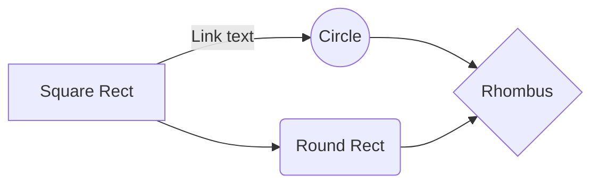
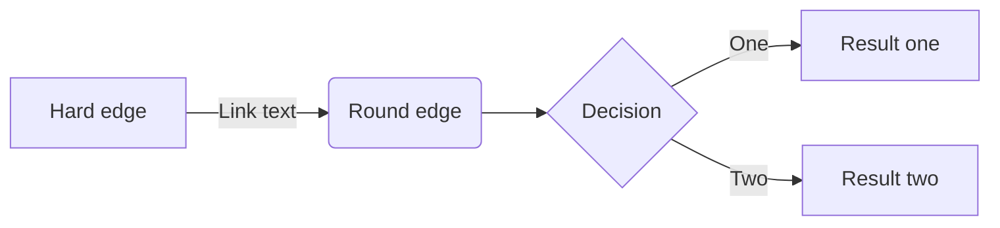

{width=100px height=100px}

# Notizie veloci open-access per divulgatori, giornalisti e operatori della libera informazione
***Fast Free News***

## Introduzione

Il progetto è un facsimile di come potrebbe essere un prodotto editoriale di consultazione di articoli open access. Nella traccia è richiesto di sviluppare uno strumento che consenta di consultare in maniera accessibile e veloce degli articoli open access in base all’argomento trattato. 

## Ideazione 

### Tema
Il progetto presenta un modo comodo e veloce per cercare gli articoli più di tendenza di un macro argomento che si possono consultare e riutilizzare per la produzione di altri contenuti editoriali. 

La possibilità di prendere informazioni direttamente dalle fonti, in qualunque momento, rende la consultazione delle pagine e degli articoli molto più rapida. 

Inoltre per ogni link ipertestuale ci sono dei brevi riassunti concisi che comunicano gli argomenti che saranno trattati nello specifico all’interno dell’articolo.   

### Destinatari
#### Alessandro  

Alessandro ha 23 anni è giornalista di gallarate tomorrow, specializzato in articoli in ambito sanitario.

Alessandro guarda molto i social media per restare aggiornato e si informa soprattutto online cercando articoli scientifici di medicina pubblicati da ricercatori in tutto il mondo. 

#### Roberta

Roberta ha 46 anni è giornalista presso il sole 12 ore, specializzata sopratutto nello spigare l'impatto economico che hanno le nuove tecnologie.

Roberta si informa sopratutto sul campo e dalle fonti fisiche e dalle conoscenze, ovviamente per restare aggiornata non può fare a meno di consultare gli articoli pubblicati online, usa poco i social media se non per svago.

#### Sandro 

Sandro ha 36 anni, è un eco attivista e divulgatore scientifico.

Sandro ha molti contatti nel constesto universitario e consulta molto il web per cercare articoli da poter utilizzare per i suoi lavori editoriali (video, podcast, riviste...), è molto attivo sulle piattaforme di condivisione di contenuti online.

Tutte le personas considerate per lo svolgimento del progetto sono individui che ne trarrebbero molti vantaggi (soprattutto Sandro). 

La possibilità di informarsi in maniera libera e di consultare direttamente le fonti è un vantaggio notevole per le personas considerate considerando anche il fatto che molto probabilmente quelle fonti le useranno per i loro progetti editoriali. 

### Modello di fruizione
Il modello di fruizione segue un modello non lineare. Infatti gli utenti saltano da un articolo all’altro attraverso i collegamenti ipertestuali. Questo tipo di modello di fruizione mi sembra adeguato per il target di utenti elencati nella traccia del progetto. Il portale dal quale si può accedere ai link è pensato per essere graficamente il più semplice e navigabile possibile, questo per marcare il concetto di semplicità della piattaforma di reperimento dei contenuti. 

Si è preso come standard di riferimento la pubblicazione di post su social come X o treads, la differenza con questa piattaforme è il pubblico di riferimento, che  è meno ampio. Inoltre gli utenti che fruiscono del web book non possono aggiungervi contenuti o commenti, questo per garantire la qualità del progetto.     

### Canali di distribuzione
Presentare i canali di distribuzione che si intendono raggiugnere e i formati dati richiesti da ogni canale. Esempi di canali sono: (i) Web, (ii) Social, (iii) Market place, (iv) Intranet. Esempi di formati. (i) Word, (ii) ePub, (iii) CBZ, (iv) PDF, (v) WebBook. 
Proporre alcuni accenni relativi all'identità visuale e alle regole tipografiche o di stile che si intendono seguire. Nel settore esistono classi di documento standard? Dati gli obiettivi è importante trasmettere un senso di adesione a modelli già conosciuti o un senso di innovazione? Lo stile sarà orientato verso un'espressione formale o informale?

## Processo di Produzione

### Acquisizione dei contenuti

Per prendere gli articoli che sono stati inseriti nel progetto sono stati utilizzati vari strumenti:

- **Google Scholar**
- **Zenodo**
- **PubMed Central **
- **Unpaywall**: un’estensione per web browser che permette di determinare, nella maggior parte dei casi, se gli articoli visualizzati sono open-access o meno.

L’inserimento di contenuti all’interno della piattaforma deve essere eseguito manualmente. 

### Gestione documentale

Descrivere il *flusso di gestione documentale* definito per il progetto. Ad esempio, (i) la raccolta o produzione dei contenuti, (ii) la valutazione dei diritti, (iii) la trasformazione dei formati, (iv) la strutturazione dei contenuti, (v) l'applicazione dello stile grafico, (vi) la generazione dei metadati, (vii) la distribuzione dei contenuti. Nella descrizione del flusso considerare le  fasi di revisione, controllo e approvazione che possono richiedere le diverse fasi.

### Tecnologie adottate

Le tecnologie adottate sono state: 

- I file markdown, portatili e facili da modificare.
- I web book, tecnologia principale del progetto che permette appunto di consultare gli articoli tramite collegamenti ipertestuali. I web book sono estremamente portabili, facili da mantenere e non hanno bisogno di tecnologie proprietarie. 

Il web book è stato scelto perché data la sua natura portabile si presta bene al compito assegnato per il progetto ed essendo una tecnologia relativamente recente e ancora in espansione è adattabile a diverse esigenze di pubblicazione. 

Per la produzione del web book è stato utilizzato [Hugo](https://github.com/gohugoio/hugo) che permette di trasformare le pagine markdown in “post” da inserire all’interno del web book che permettendo di visualizzare pagine html statiche, e [GitHub Actions](https://docs.github.com/en/actions) che permette di hostare il web book e di modificarlo senza installare Hugo e le sue dipendenze.

### Esecuzione del flusso

Allegare, possibilmente attraverso il riferimento ad un repository documentale, i materiali, gli script, le configurazioni, che permettono di riprodurre il flusso di produzione documentale. I contenuti non devono necessariamente essere completi, può essere sufficiente fornire un prototipo per ogni tipologia di contenuto previsto e per ogni formato di destinazione previsto.  

## Valutazione dei risultati raggiunti

### Valutazione del flusso di produzione

Per valutare il contributo proposto valutare le diverse fasi del flusso in termini di (i) riduzione dei tempi di gestione documentale, (ii) riduzione degli errori, (iii) miglioramento della qualità dei documenti, (iv) miglioramento del livello di accettazione della tecnologia, (v) raggiungimento di nuovi canali di distribuzione, (vi) soddisfacimento di nuovi scenari d'uso.

### Confronto con lo stato dell'arte

Può anche essere utile confrontare una versione ASIS del flusso di gestione, senza la tecnologia o le innovazioni proposte, e una TOBE che include la tecnologia e le innovazioni proposte dallo studente.

### Limiti emersi

È importante sottolineare i limiti emersi. Come l'impossibilità di accesso ad alcune tecnologie o fasi del flusso di gestione documentale, limiti nella automazione di alcune passi di trasformazione dei formati o di integrazione delle sorgenti

## Conclusioni

Discutere i risultati ottenuti, verificando se gli obiettivi definiti dai casi d'uso siano pienamente o parzialmente raggiunti. Evidenziare gli aspetti nei quali si sono raggiunti i risultati più soddisfacenti e le limitazioni emerse.

## Bibliografia e sitografia

Elencare i riferimenti bibliografici e risorse online che hanno maggiormente contribuito alla realizzazione del progetto. Ad esempio [@sechi2010,@pantieri2021,@ceravolo2023]
