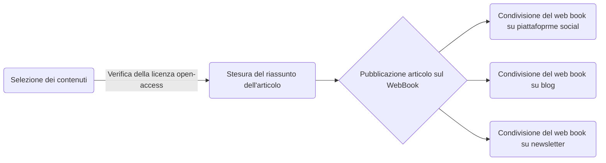

{width=100px height=100px}

# Notizie veloci open-access per divulgatori, giornalisti e operatori della libera informazione
***Fast Free News***

## Introduzione

Il progetto è un facsimile di come potrebbe essere un prodotto editoriale di consultazione di articoli open-access. Nella traccia è richiesto di sviluppare uno strumento che consenta di consultare in maniera accessibile e veloce articoli open-access in base all’argomento trattato.

## Ideazione

### Tema
Il progetto presenta un modo comodo e veloce per cercare gli articoli più di tendenza di un macro argomento, che si possono consultare e riutilizzare per la produzione di altri contenuti editoriali.

La possibilità di prendere informazioni direttamente dalle fonti, in qualunque momento, rende la consultazione delle pagine e degli articoli molto più rapida.

Inoltre, per ogni link ipertestuale ci sono brevi riassunti concisi che comunicano gli argomenti trattati nello specifico all’interno dell’articolo.

### Destinatari
#### Alessandro

Alessandro ha 23 anni, è giornalista di Gallarate Tomorrow, specializzato in articoli in ambito sanitario.

Alessandro guarda molto i social media per restare aggiornato e si informa soprattutto online cercando articoli scientifici di medicina pubblicati da ricercatori in tutto il mondo.

#### Roberta

Roberta ha 46 anni, è giornalista presso Il Sole 24 Ore, specializzata soprattutto nello spiegare l'impatto economico che hanno le nuove tecnologie.

Roberta si informa soprattutto sul campo e dalle fonti fisiche e dalle conoscenze; ovviamente, per restare aggiornata non può fare a meno di consultare gli articoli pubblicati online. Usa poco i social media, se non per svago.

#### Sandro

Sandro ha 36 anni, è un eco-attivista e divulgatore scientifico.

Sandro ha molti contatti nel contesto universitario e consulta molto il web per cercare articoli da poter utilizzare per i suoi lavori editoriali (video, podcast, riviste...). È molto attivo sulle piattaforme di condivisione di contenuti online.

Tutte le personas considerate per lo svolgimento del progetto sono individui che ne trarrebbero molti vantaggi (soprattutto Sandro).

La possibilità di informarsi in maniera libera e di consultare direttamente le fonti è un vantaggio notevole per le personas considerate, considerando anche il fatto che molto probabilmente quelle fonti le useranno per i loro progetti editoriali.

### Modello di fruizione
Il modello di fruizione segue un approccio non lineare. Infatti, gli utenti saltano da un articolo all’altro attraverso i collegamenti ipertestuali. Questo tipo di modello di fruizione mi sembra adeguato per il target di utenti elencati nella traccia del progetto. Il portale dal quale si può accedere ai link è pensato per essere graficamente il più semplice e navigabile possibile, per marcare il concetto di semplicità della piattaforma di reperimento dei contenuti.

Si è preso come standard di riferimento la pubblicazione di post su social come X o Threads; la differenza con queste piattaforme è il pubblico di riferimento, che è meno ampio. Inoltre, gli utenti che fruiscono del web book non possono aggiungervi contenuti o commenti, per garantire la qualità del progetto.     

### Canali di distribuzione
Presentare i canali di distribuzione che si intendono raggiugnere e i formati dati richiesti da ogni canale. Esempi di canali sono: (i) Web, (ii) Social, (iii) Market place, (iv) Intranet. Esempi di formati. (i) Word, (ii) ePub, (iii) CBZ, (iv) PDF, (v) WebBook. 
Proporre alcuni accenni relativi all'identità visuale e alle regole tipografiche o di stile che si intendono seguire. Nel settore esistono classi di documento standard? Dati gli obiettivi è importante trasmettere un senso di adesione a modelli già conosciuti o un senso di innovazione? Lo stile sarà orientato verso un'espressione formale o informale?

I canali di distribuzione, richiesti nella traccia, per questo prodotto sono: 

- **News letter**: il web book è perfettamente adatto per questo canale di distribuzione, dove è possibile comunicare vari aggiornamenti relativi all’aggiunta di contenuti sul sito. 
- **Social media**: il web book, pur non essendo direttamente fruibile sulla maggior parte delle piattaforme social più diffuse, può essere pubblicizzato su di esse.
- **Blog**: il formato scelto è ideale per la pubblicazione su blog o siti web, in parte perché il prodotto segue un modello di aggiornamento e fruizione simile a questo tipo di canali.   

Il formato principale di visualizzazione dei contenuti è il WebBook che per funzionare ha bisogno di pagine in markdown da poter convertire nei post del sito. 

Come accennato nella sezione precedente, l’identità visuale del prodotto è pensata per essere il più semplice e fruibile possibile utilizzando uno dei temi forniti direttamente da Hugo, ovvero [PaperMod](https://github.com/adityatelange/hugo-PaperMod). Questo rende il prodotto più *anonimo* e formale, ma essendo un portale di consultazione di fonti aperte non mi è sembrato necessario dargli una forte identità visuale.    

## Processo di Produzione

### Acquisizione dei contenuti

Per prendere gli articoli che sono stati inseriti nel progetto sono stati utilizzati vari strumenti:

- **Google Scholar**
- **Zenodo**
- **PubMed Central **
- **Unpaywall**: un’estensione per web browser che permette di determinare, nella maggior parte dei casi, se gli articoli visualizzati sono open-access o meno.

L’inserimento di contenuti all’interno della piattaforma deve essere eseguito manualmente, quindi non è un processo automatico. 

### Gestione documentale

### Tecnologie adottate

Le tecnologie adottate sono state:

- I file markdown, portatili e facili da modificare.
- I web book, tecnologia principale del progetto che permette di consultare gli articoli tramite collegamenti ipertestuali. I web book sono estremamente portabili, facili da mantenere e non necessitano di tecnologie proprietarie.

Il web book è stato scelto perché, data la sua natura portabile, si presta bene al compito assegnato per il progetto ed essendo una tecnologia relativamente recente e ancora in espansione, è adattabile a diverse esigenze di pubblicazione.

Per la produzione del web book è stato utilizzato [Hugo](https://github.com/gohugoio/hugo), che permette di trasformare le pagine markdown in "post" da inserire all’interno del web book, consentendo di visualizzare pagine HTML statiche, e [GitHub Actions](https://docs.github.com/en/actions), che permette di ospitare il web book e di modificarlo senza installare Hugo e le sue dipendenze.

Per l‘utilizzo delle GitHub Actions è stato impiegato il [workflow](https://docs.github.com/en/actions/concepts/workflows-and-actions/about-workflows) di Hugo fornito direttamente da GitHub, poi modificato in base alle esigenze del progetto.

### Esecuzione del flusso

- [Link alla repo del progetto](https://github.com/paoloResciUNI/Fast-Free-News)
- [Link al WebBook](https://paoloresciuni.github.io/Fast-Free-News/)

## Valutazione dei risultati raggiunti

Il progetto presentato permette agli utenti di ottenere in maniera facile e veloce articoli da consultare e riutilizzare. Ciò consente di risparmiare tutto il processo di verifica delle fonti e dei permessi degli articoli. La tecnologia utilizzata permette di gestire tutto il processo documentale (per chi carica gli articoli scientifici sul WebBook) in maniera rapida e semplice, con possibilità di aggiornare, modificare e rimuovere contenuti in tutta sicurezza, poiché tutte le modifiche vengono salvate e applicate solo dopo i commit su GitHub.

Le tecnologie implementate permettono anche di migliorare il prodotto, aggiungendo funzionalità al tema usato o cambiandolo totalmente.

Senza le tecnologie implementate sarebbe stato necessario, per l’utente, ricercare manualmente gli articoli e verificarne personalmente le licenze open-access, magari in un ritaglio di tempo dedicato. Così invece si potrebbe consultare il WebBook in qualunque momento e, leggendo il riassunto per ogni articolo, salvare i link agli articoli che possono tornare più utili senza controllare eventuali licenze.

Tra le limitazioni più importanti emergono:

- La dipendenza da GitHub e dalle GitHub Actions per ospitare le pagine web.
- La dipendenza dal mantenimento di Hugo (anche se è una tecnologia open source).

Se GitHub decidesse di terminare il suo servizio di hosting, bisognerebbe trovare un provider dove caricare le pagine web; ciò inoltre richiederebbe agli utenti di installare Hugo e tutte le sue dipendenze.

## Conclusioni

I risultati raggiunti portano a pensare che questo tipo di prodotto potrebbe semplificare una parte del lavoro di giornalisti e divulgatori scientifici, seppure limitato ai soli articoli riportati sul WebBook. Se non sono presenti gli articoli o gli argomenti cercati, allora bisogna pensare di procurarseli senza l'ausilio del prodotto editoriale sviluppato per il progetto.

## Bibliografia e sitografia

[@Hugo,@GitHubActions,@ceravolo2023, @GoogleScholar, @Zenoto, @PubMedCentra]
